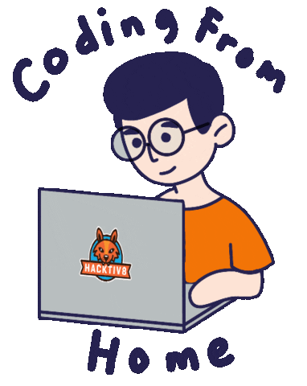

  <!-- ==================== HERO SECTION // GRAPHIC NOVEL DOSSIER ==================== -->
  

    

  <!-- Character & Profile Illustration Integration -->
  

    

  <!-- Technical Terminal Typing Animation -->
  

  <!-- Identity Line -->
  

    <code>◆</code> <b>Computer Science & Engineering</b> &nbsp;<code>·</code>&nbsp; <b>Chennai, India 🇮🇳</b> <code>◆</code>
  

  <!-- Dossier Control Badges -->
  

    
    &nbsp;
    
    &nbsp;
    
    &nbsp;
    
  

---

## 👨‍💻 ABOUT ME

Computer Science student & **Software Developer** based in Chennai, India 🇮🇳  
Passionate about engineering clean, scalable full-stack applications, robust backend systems, and solving complex problems with high-performance code.

---

## 🛠️ TECHNICAL SKILLS

#### `[ 01 // CORE COMPUTATIONAL LANGUAGES ]`

  

#### `[ 02 // WEB SYSTEMS & BACKEND ARCHITECTURE ]`

  

#### `[ 03 // DATA ARCHITECTURE & STORAGE ]`

  

#### `[ 04 // INFRASTRUCTURE, DEVOPS & TOOLING ]`

---

## 📊 GITHUB ACTIVITY

  
  &nbsp;
  
    
  

---

## 🐍 CONTRIBUTION ACTIVITY

  <picture>
    <source media="(prefers-color-scheme: dark)" srcset="https://raw.githubusercontent.com/Balaji-1206/Balaji-1206/output/github-snake-dark.svg"/>
    <source media="(prefers-color-scheme: light)" srcset="https://raw.githubusercontent.com/Balaji-1206/Balaji-1206/output/github-snake.svg"/>
    
  </picture>

---

## 📬 LET'S CONNECT

  
  &nbsp;&nbsp;
  
  &nbsp;&nbsp;
  

<!-- ==================== FOOTER // GRAPHIC NOVEL DOSSIER ==================== -->

  

  

    Profile overview of <b>Balaji P</b> · Software Developer
  

